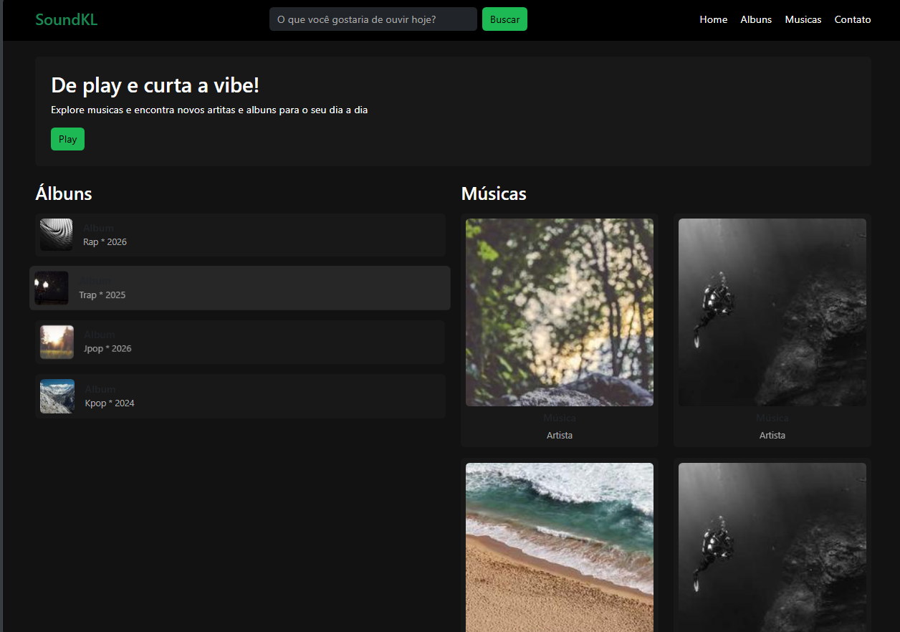
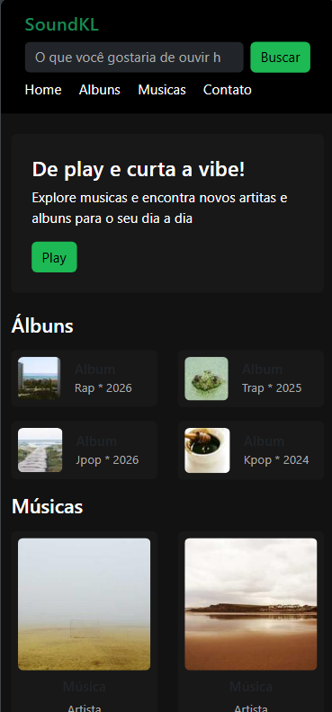
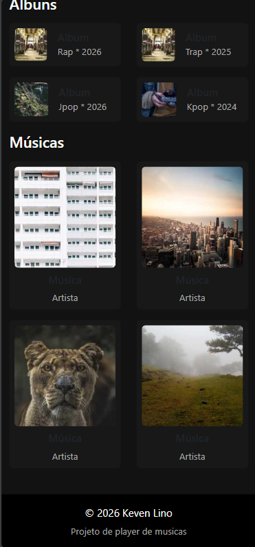

# Trabalho Prático - Semana 6

## Informações Gerais
- Nome:Keven Henrique de Carvalho Lino
- Matricula: 926902
- Proposta de projeto escolhida: Player de Musica
- Breve descrição sobre seu projeto:Para este projeto, será desenvolvida uma página web inspirada no Spotify, com o objetivo inicial de funcionar como uma galeria de músicas. A aplicação permitirá a exibição organizada de faixas, incluindo informações como nome, artista e capa, proporcionando uma navegação simples e intuitiva.

## Print da versão responsiva com Bootstrap [DESKTOP]

## Print da versão responsiva com Bootstrap [MOBILE]

